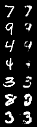
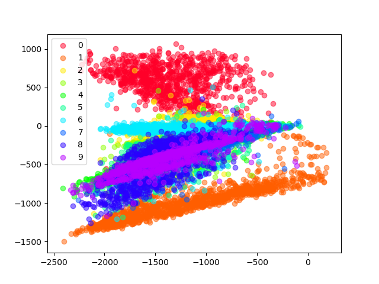
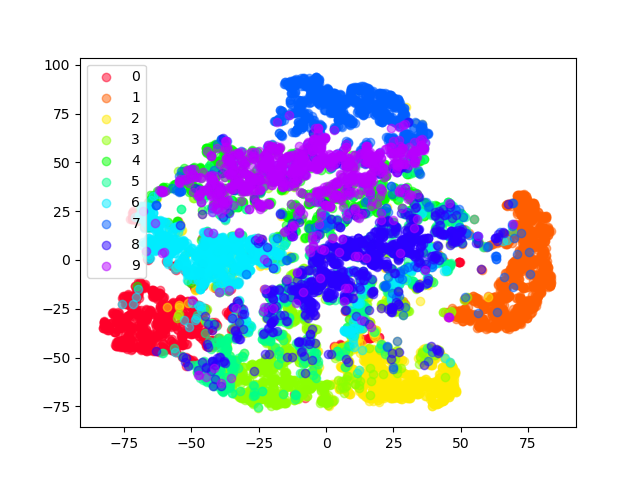
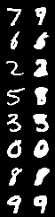
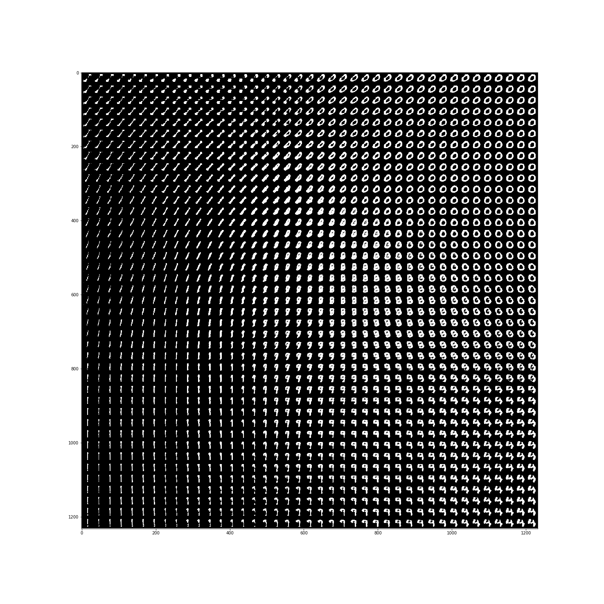
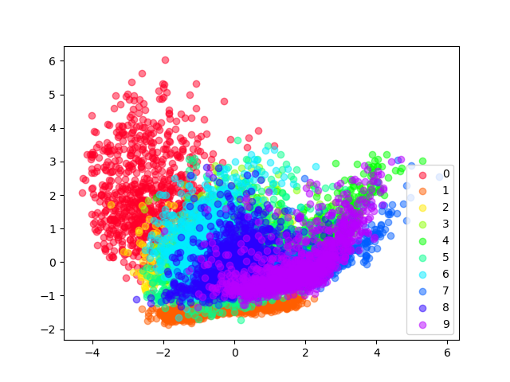

# Playground project for generative models in PyTorch
# 1. Autoencoders
### Plain Autoencoders
Autoencoders aim to reconstruct their input with a bottleneck, hence having to learn how to best encode data with least loss of information. \
We have two models for autoencoders.
1. Fully Convolutional model \
This model has only convolutional layers and shrinking the size of the image by seven but enlarging channels to 128. This means that by the shear amount of parameters it should be able to just memorize the input and was more of a validation of training procedure. \

2. Convolutional model with linear hidden dimension \
Opposed to the Fully Convolutional model this model has linear layers as bottleneck shrinking the hidden representation dimension to two. \
 \
Encoding visualized in hidden space \

#### t-SNE representation of hidden space
To see if the learned hidden representation is a generalization, we sample from the test set and visualize their hidden represention using t-SNE. \

### Variational Autoencoders (VAE)
Variational autoencoders similarily to Autoencoders trying to find a good hidden encoding for reconstruction of input data. However, they encode to a mean and variance. For decoding it is sampled from a Normal distribution with given mean and variance. Additional to reconstruction loss the KL-divergence between the hidden distribution and a standard normal distribution is penalized. \
 \
As a big advantage over standard autoencoders we have a meaningful hidden representation and can generate artificial samples. \
 \
Visualization of encoding of mean values in hidden 2d space. Note how it is much more centered around zero. \
