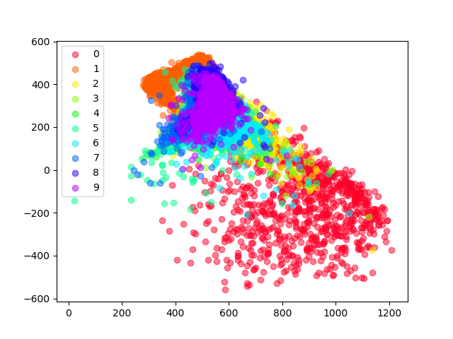

# Playground project for generative models in PyTorch
In this project I want to implement and try several approaches on generating artificial data from scratch. 
# About data
As these are all Machine Learning models they learn from given data. We are using two different datasets until now. [MNIST](http://yann.lecun.com/exdb/mnist/) and [CelebA](http://mmlab.ie.cuhk.edu.hk/projects/CelebA.html). However, it is straightforward to extend implementation to other datasets.
# 1. Autoencoders

    
 
 
<b>Architecture details</b>
 
  
Autoencoder architecture is fully described by a set of parameters:
    - base_channels: Number of channels after first convolution
    - conv_blocks_per_decrease: Convolutions in each downsizing module
    - channel_increase_factor: Factor by which channels increase after each downsizing module
    - encode_factor: Number of downsizing modules
    - latent_dim: Dimension of encoding vector
    - initial_upsample_size: Start resolution in decoder
    - skip_connections: Use ResNet like skip connections in downsizing modules
    - auxillary: Allow encoder to also learn class labels (makes training easier)
For a more exact description see [configs folder](configs/README.md)
    
A model summary can be retrieved by running `python -m models.Autoencoder -h`. Note: parameters in summary are currently hardcoded.
    
 

 
<b>Convolutional model with linear hidden dimension</b>
 

    
Autoencoder, that encodes to a n-dimensional linear feature vector. n is dependent on architecture parameters. Standard is 128.
    
 
<b> Reconstructions results for standard Autoencoder (128 dimensions) </b>  

|  | 
|:--:|
|MNIST|
    
<!---
|  |  |
|:--:|:--:|
|MNIST|CelebA|
--->

<!--- Encoding visualized in hidden space \
 --->
#### t-SNE representation of hidden space
To see how well the model is seperating classes, we sample from the test set and visualize their hidden represention using t-SNE. We use MNIST as we have class labels.  

 

 

 
<b> Variational Autoencoders (VAE) </b>
 
  
Variational autoencoders similarily to Autoencoders trying to find a good hidden encoding for reconstruction of input data. However, they encode to a mean and variance, where the minimization of KL-divergence to a standard normal distribution is part of optimization objective. Thus artificial data can be generated by sampling from a standard normal distribution and decode these.  
<b> Reconstruction of given test samples </b>  

|  | 
|:--:|
|MNIST|

<!---
|  |  |
|:--:|:--:|
|MNIST|CelebA|
--->

<!---
<b> Randomly generated artificial samples </b>  

|  |  |
|:--:|:--:|
--->

<b> Reconstructed samples from linear grid in two dimensions </b>  
  

<!--- Visualization of encoding of mean values in hidden 2d space. Note how it is much more centered around zero. \
 --->

# 2. Generative Adverserial Networks (GANs)

 
<b> Vanilla GAN </b>
 
  
  Original GANs (Goodfellow et al) that are based upon linear layers in generator and discriminator.
  
  

 
<b> DC GAN </b>
 
  
  Concept of GANs that utilize convolutional layers in generator and discriminator.
  
  

 
<b> Auxillary GAN </b>
 
  
  DC GAN but labels of dataset are used as generator input and discriminator output.
  

