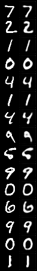
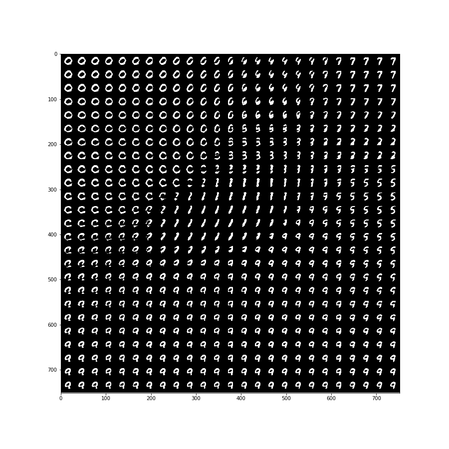

# Playground project for generative models in PyTorch
In this project I want to implement and try several approaches on generating artificial data from scratch. 
# About data
As these are all Machine Learning models they learn from given data. We are using two different datasets until now. [MNIST](http://yann.lecun.com/exdb/mnist/) and [CelebA](http://mmlab.ie.cuhk.edu.hk/projects/CelebA.html). However, it is straightforward to extend implementation to other datasets.
# 1. Autoencoders
## Architecture
The models are all based on two basic building blocks.
1. Down Block \
This block is used in the encoder. It divides the resolution by two while doubling the number of channels.
2. Up Block \
The inversion of the Down Block for the decoder. Doubles resolution by halving the number of channels.
### Plain Autoencoders
Autoencoders aim to reconstruct their input with a bottleneck, hence having to learn how to best encode data with least loss of information. \
We have two models for classical autoencoders.
1. Fully Convolutional model \
This model decreases the image resolution while enlarging the number of channels. However, it is fully convolutional, without any fully connected layers. In the bottleneck data therefore is represented by a small resolution image with a large number of channels. \
<b> Reconstruction results for MNIST and CelebA. (Left: original/Right: reconstructed) </b> \
 \
 
2. Convolutional model with linear hidden dimension \
The model is based on the Fully Convolutional model. However, it enforces a stronger encoding by having a n-dimensional hidden vector as bottleneck where n is small (e.g. 16). This is done by having a Fully Connected Layer from the convolutional representation and one more back. \
<b> Reconstructions results for Autoencoder with hidden vector </b> \
 \ 
 \ 
<!--- Encoding visualized in hidden space \
 --->
#### t-SNE representation of hidden space
To see how well the model is seperating classes, we sample from the test set and visualize their hidden represention using t-SNE. We use MNIST as we have class labels. \

### Variational Autoencoders (VAE)
Variational autoencoders similarily to Autoencoders trying to find a good hidden encoding for reconstruction of input data. However, they encode to a mean and variance, where the minimization of KL-divergence to a standard normal distribution is part of optimization objective. Thus artificial data can be generated by sampling from a standard normal distribution and decode these. \
<b> Reconstruction of given test samples </b> \
 \
 \
<b> Randomly generated artificial samples </b> \
 \
 \
<b> Reconstructed samples from linear grid in two dimensions </b> \
 \
<!--- Visualization of encoding of mean values in hidden 2d space. Note how it is much more centered around zero. \
 --->